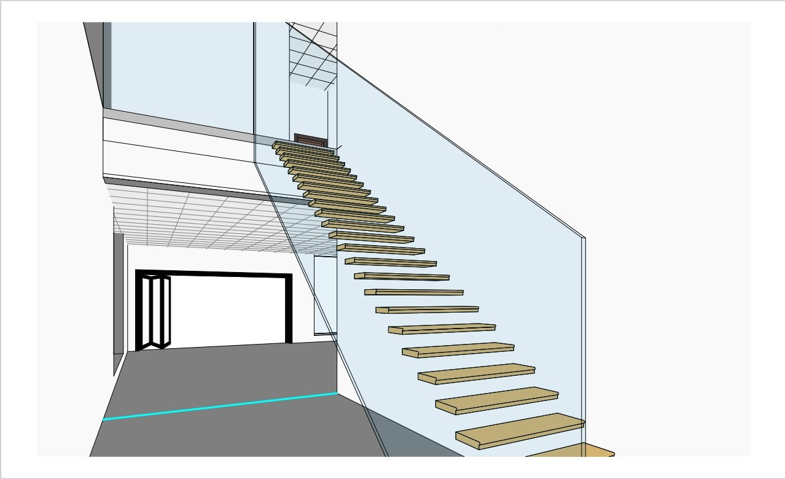

# Introduction
This project is a model of a two story residential modern house with the location set in Abu Dhabi city, United Arab Emirates. The aim of this project is to model the MEP (HVAC, Plumbing, Firefighting, and Lightning) services with the goals of achieving comfort, reliability, and most importantly energy efficiency.

The model is built with Revit Software, a highly regarded Building Information Modelling (BIM) with robust features. The model will be divided into three Revit files:
- Architectural 
- Mechanical 
- Electrical 

## Scope of Modelling:
#### HVAC
- Fan Coil Units FCU
- Ducts
- Chilled Water Piping

#### Plumbing
Drainage system (waste, soil, vent)

#### Fire-Fighting 
- Sprinklers 
- Fire fighting network 

## Floor Plans
First Floor

Second Floor

## Elevations

South Elevation

North Elevation

Interior

## HVAC System Design and Modeling

### System Selection
A Variable Air Volume (VAV) System was selected due to its efficiency, flexibility, and ability to enhance thermal comfort. VAV systems provide precise temperature control, improved energy efficiency, and better indoor air quality compared to constant air volume systems.

#### Steps in HVAC System Design:

### 1. Defining HVAC Spaces

Each enclosure within the building, including rooms, corridors, lounges, and shafts, was designated as a distinct HVAC space. This step involved specifying the unique thermal comfort parameters required for each area, such as temperature setpoints, humidity levels, and ventilation requirements.

### 2. Heating and Cooling Load Calculations

Once the HVAC spaces were defined, Revit’s heating and cooling load calculation tool was employed to determine:

- **Cooling Loads** – The amount of heat energy that needs to be removed to maintain a comfortable temperature.

- **Heating Loads** – The amount of heat energy required to maintain thermal comfort during colder periods.

- **Supply Air Flow Rates** – The necessary airflow volume to meet cooling and heating demands efficiently.

Comfort metrics such as temperature setpoints and air quality parameters were selected, and the project location was set to the United Arab Emirates to incorporate local weather data, ensuring accurate results.

### 3. Supply Air System Design

With the calculated heating and cooling loads, the next step was designing the supply air distribution system:

- Supply air diffusers were strategically placed in each conditioned space to ensure uniform airflow distribution.

- A parameter named *Airflow Delta* was introduced, representing the percentage difference between the actual and required airflow in each space.

- To achieve efficient and satisfactory air supply, adjustments were made to keep the *Airflow Delta below 5%*.

### 4. Secondary Supply Air System Design

- VAV boxes were placed to regulate airflow in each space dynamically.

- Supply diffusers were connected to VAV boxes through a network of ducts.

- Duct routing was optimized to minimize friction loss and reduce duct lengths.

- Revit’s duct sizing tool was used to size ducts using the friction method, setting friction losses to 0.4 Pa.

### 5. Primary Supply Air System Design

- The primary supply air system was designed by routing ducts to connect all VAV boxes.

- The duct routing approach aimed to minimize friction losses and optimize airflow distribution.

- Revit’s duct sizing tool was employed again, but this time using the velocity method, setting airflow velocity to 5 m/s to ensure proper air movement within the system.

### 6. AC Unit Placement and System Integration

- A rooftop AC unit was selected and positioned on the building’s roof.

- The main supply air duct was routed to connect the AC unit with the primary supply air systems on both the ground and first floors.

- This final step completed the VAV System, ensuring a well-integrated, efficient, and high-performance HVAC system.
